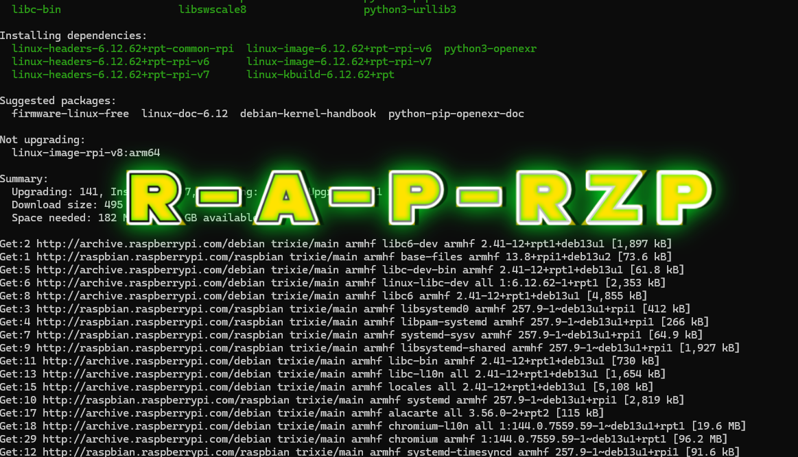

# ****💀 OUTDATED 💀****
# Setup_redirect_ap


## The Setup
▶️ STEP 1 :
Run :
```bash
sudo apt install git
git clone https://github.com/prankapple/Setup_redirect_ap.git
cd Setup_redirect_ap
```

▶️ STEP 2: Make it executable & run it

```bash
chmod +x setup_redirect_ap.sh
sudo ./setup_redirect_ap.sh
```

Reboot:
```bash
sudo reboot
```
📡 WHAT YOU’LL SEE AFTER REBOOT

Wi‑Fi network: MyRedirectWiFi

Password: supersecretpassword

Internet works normally

Visiting:

google.com → normal

facebook.com → redirected to Pi page

🔒 HTTPS LIMITATION (very important)

HTTPS cannot be silently redirected

DNS redirect still works, but browsers may warn

This is normal and unavoidable

Used everywhere in:

Captive portals

Parental control routers

Ad‑blockers (Pi‑hole style)

🛠️ CUSTOMIZATION
Change Wi‑Fi name/password

Edit:
```bash
/etc/hostapd/hostapd.conf
```
Add more redirected sites

Edit:
```bash
/etc/dnsmasq.conf
```

Example:
```
address=/tiktok.com/192.168.4.1
address=/instagram.com/192.168.4.1
```

Then:
```bash
sudo systemctl restart dnsmasq
```
⚠️ LEGAL NOTE

Only use this on:

Your own devices

Devices with user consent

Labs, learning, parental control, kiosks
